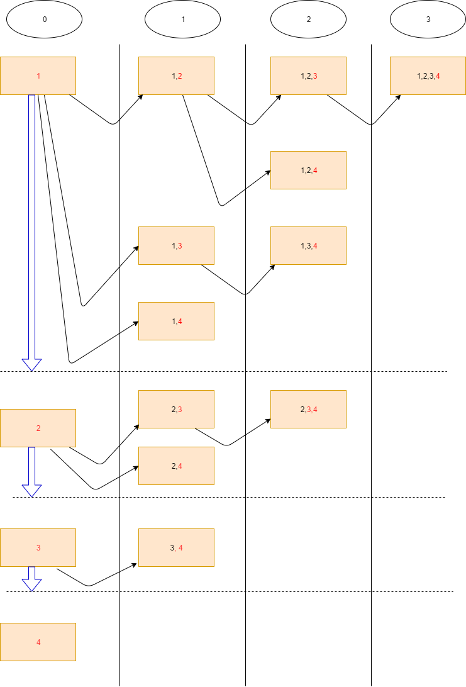

## LinkedList 

https://leetcode.com/problems/add-two-numbers/

# Basic operations: 

1. loop two lists: 
```
while p1 or p2: 
  if p1:
    # operate p1
    p1 = p1.next
  if p2: 
    # operate p2
    p2 = p2.next
```
Tips: 
1.  p1 or p2. if p2 not None, operate, otherwise ignore.

2. create dummy node: 
```
  dummy = ListNode()
  p = dummy
```

## Two pointer in Array

https://leetcode.com/problems/longest-substring-without-repeating-characters

# Basic Operation 
1. two pointers:

 ```
 slow = 0
 for i in range(0 ,len(s)):
    if *condition*:
      # operate slow
    # operations with all, like maxLen = max(maxLen, i - slow)
 ```
 
 2. distance between two indexes: 
 
| 2 | 8 | 10 | 7 | 11 | 6 |
|---|---|----|---|----|---|
| 0 | 1 |  2 | 3 |  4 | 5 |

i to j: j - i + 1 
like 1 to 4: 4 - 1 + 1 = 4, [8, 10, 7, 11]

3. use map to store visited index so could get the previous index within O(1) time


# BackTrack Problems:

## Subset/Permutation/Combination 

Template

### subset: 

Solution: 

for subset, each item = [added items] + [i]] + (subsets from i+1 to len(nums)-1)

 1 | 2 | 3 | 4 | 
|---|---|----|---|
| 0 | 1 |  2 | 3 |




code:
```
def subsetsWithDup(self, nums: List[int]) -> List[List[int]]:
        result = []
        nums.sort()
        def dfs(start: int, tempList:List[int]):
            result.append(list(tempList))
            for i in range(start, len(nums)):
                # this line is for subset II: remove duplicate elements
                if i != start and nums[i] == nums[i-1]:
                    continue
                tempList.append(nums[i])
                dfs(i+1, tempList)
                del tempList[-1]
        dfs(0, [])
        return result

```
